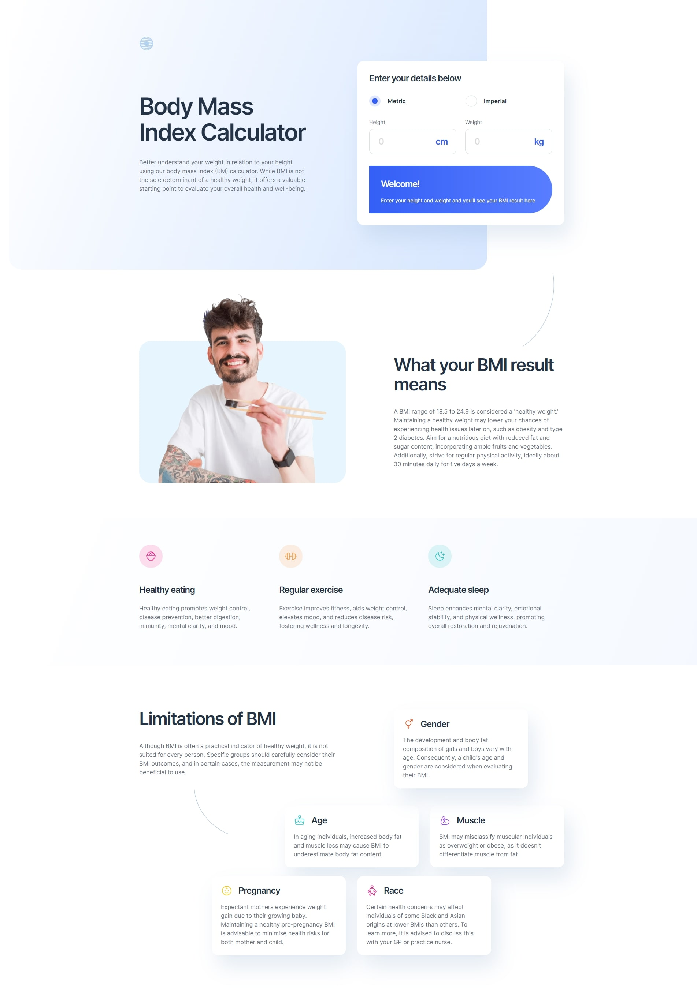

# Frontend Mentor - Body Mass Index Calculator solution

This is a solution to the [Body Mass Index Calculator challenge on Frontend Mentor](https://www.frontendmentor.io/challenges/body-mass-index-calculator-brrBkfSz1T). Frontend Mentor challenges help you improve your coding skills by building realistic projects. 

## Table of contents

- [Overview](#overview)
  - [The challenge](#the-challenge)
  - [Screenshot](#screenshot)
  - [Links](#links)
- [My process](#my-process)
  - [Built with](#built-with)
  - [What I learned](#what-i-learned)
- [Author](#author)

## Overview

### The challenge

Users should be able to:

- Select whether they want to use metric or imperial units
- Enter their height and weight
- See their BMI result, with their weight classification and healthy weight range
- View the optimal layout for the interface depending on their device's screen size
- See hover and focus states for all interactive elements on the page

### Screenshot

### Links

- Solution URL: [(https://www.frontendmentor.io/solutions/responsive-landing-page-with-body-mass-index-calculator-on-it-lQZO4VDhUu)]
- Live Site URL: [(https://costbound.github.io/bmi-calculator/)]

## My process

### Built with

- Semantic HTML5 markup
- CSS custom properties
- Flexbox
- Mobile-first workflow
- JavaScript

### What I learned

- How to work with dinamicly height changing containers. How to make it good looks like by using transistion: max-height...  and JavaScript;
- How to use setTimeout();
- Good practice of CSS and JS skills;
 
## Author

- Website - [Add your name here](https://github.com/Costbound)
- Frontend Mentor - [@Costbound](https://www.frontendmentor.io/profile/Costbound)
